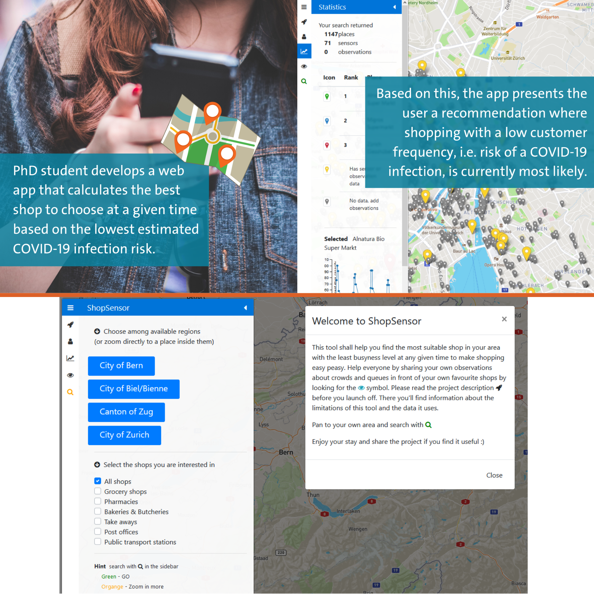

# This is the underlying code to the public WebApp [ShopSensor](https://shopsensor-272815.appspot.com/)

This webapp __Shopsensor__ resulted out of the __Monitoring COVID-19 Effects Remote Hackathon__ organised by the 
Statistics Office of the Canton of Zurich, Switzerland in cooperation with the Opendata-Szene. 
Shopsensor uses on the internet available data on customer frequency
data as well as user generated observation data to perform a top 3 shop recommendation for a given area where the fewest
customers are expected. The heart of the application is the web-scrapper that runs in the background and feeds the database
with the most recent sensor data on customer frequencies in over 2500 shops in the Swiss cities: Zurich, (Canton of) Zug, Bern and Biel.
At the end of Shopsensors lifetime (24.09.2020) the database contained over 1.3 Million entries and over 100 contributions
supplied by Shopsensor users.

### Parts
- ShopSensor Flask App (`ShopSensorGAE` module)
- Multiprocess Place Popularity minging script (mining -> `executor_popular_times.py`)
- Google Place API querying script (mining -> `query_placeAPI.py`)

### Setup
1. Look for <ADD HERE> string and replace with your adapted input
2. I would recommend setting up an individual server for the scraping process since it requires a lot of 
computation power if a high data retrieval frequency is desired. That's where `executor_popular_times.py` should run.
The mining script is capable of running on multiple cores.
3. Setup Web hosting server on e.g. Google App Engine

### Mentions in Media
- [Tageblatt Newspaper](https://www.tagblattzuerich.ch/aktuell/news/news-detail/article/uni-student-sorgt-fuer-sichereres-einkaufen.html)
- [University of Zurich Article](https://www.news.uzh.ch/en/articles/2020/Shopping-with-Maximilian.html)
- [University of Zurich (Instagram)](https://www.instagram.com/p/B_1zOSFART_/)
- [Department of Geography UZH Article](https://www.geo.uzh.ch/en/department/125/blog/shopsensor.html)

### Credits - Used Packages
- [social_distance](https://github.com/pkreissel/social_distance) by @pkreissel - with adaptations 
- [python-google-places](https://github.com/slimkrazy/python-google-places) by @slimkrazy (Google Place API Wrappyer)
- [leaflet-sidebar-v2](https://github.com/noerw/leaflet-sidebar-v2) by @noerw (Navigation bar)

__Remark__ I take no liability for this code nor any warranty for what people do with it. Also I won't be actively updating this repo.